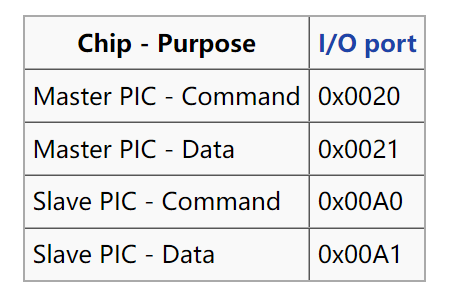
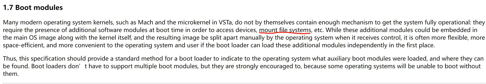

# ECE391 MP3

> **Notes about all the documents and materials related to ECE391 MP3.**
> 

> **Group 11 — ZinixOS**
> 

> Mmebers: Zicheng Ma, Ziyuan Chen, Zhirong Chen, Shihua Zeng
> 

> Language: 中英结合
> 

# Checkpoint 1

## OS Booting: GDT & IDT Setup

### GDT

在`x86_desc.S`中创建`gdt_desc`标记（参考`ldt_desc`）

- 48B，包括`.word`长度的limit和`.long`长度的base

在`boot.S`中用`lgdt gdt_desc`载入

### IDT

在`interrupt.c`中定义handlers

- 对于Exception，打印错误信息+无限循环（“蓝屏”）**（无限循环没有写）**
- 对于Interrupt，在函数体中调用~~带Offset参数~~的linkage（无参数），在asm中定义linkage函数（Push all, call handler, pop all, **iret**）（注意iret是写asm wrapper的根本原因）

## Device and Interrupt

---

### PIC

PIC所使用port位置



在IDT中，PIC_MASTER使用**0x20-0x27** vector呼叫handler，PIC_SLAVE使用**0x28-0x2F**呼叫handler

PIC_SLAVE链接到PIC_MASTER的**2号vector**

---

**Initialization:**

1. mask掉所有interrupt（向data port传入0xff）
2. 先给予0x11 command，然后PIC会等待接下来3个传入参数进行初始化（ICW1)
3. 接下来确定在IDT中的位置(ICW2)
4. 决定Master和Slave的cascade状况(ICW3)
5. 最后向Data port传入这是x86模式，以适配x86模式进行工作

主要对着Lecture10 PPT抄即可

---

**enable_irq / disable_irq:**

PIC内部存在一个register Interrupt Mask Register，共8bit，当对应bit位被set为1时，PIC会忽略对应位置irq。注意: mask数字高的irq不会影响数字低的irq（priority更高的irq）

先判断irq是否超过7，若超过7，向PIC_SLAVE的data port传入数据，否则向PIC_MASTERdata port传入数据


---

**send_EOI:**

同样需要检查irq number。无论如何都要给MASTER command port send EOI，如果是SLAVE的handler结束，那就给SLAVE也补上

注意: 我们的代码中EOI在send之前需要和irq做一个OR操作，以告知PIC是哪一个irq结束


补充：以上函数均需要做**sanity check**，不允许传入的irq number是一个0-15以外的数值

---

### RTC

RTC可以以多个频率运行，基础频率32.768kHz，可以用divider register改变，但是不要变，要不然不准。对于interrupt，默认产生interrupt的频率是1024Hz，可以自行修改，the RTC can theoretically generate **15 interrupt rates between 2 Hz and 32768 Hz** (2^1-2^15)

RTC handler期间，禁用NMI，否则导致RTC变成不可用状态

RTC使用**port 0x70和0x71**，0x70用来指示用哪个register，0x71包含数据。在选择register时可以顺带mask掉NMI


---

**Initialization:**

1. 打开IRQ8  这里reset原因是每次读写完之后，port 0x70的内容都会被清零，需要重新指定register，然后在这之后要enable_irq(8)


1. 选择interrupt产生的frequency
    
    寄存器A的低4位，是divider value，默认位0110即6，所以默认frequency = 2^15>>(6-1) = 1024
    
    设置好寄存器A的低4位(称为rate)后，最终**frequency = 2^15 >>(rate-1)**
    
    **rate最低只能选3**，低于3会roll over，导致interrupt频率不准
    
    
    

---

**handler:**

需要使用一个全局变量，并且需要volatile，来记录RTC产生interrupt的次数，当做时钟

这个数字，除以frequency，就可以得到当前过了多少秒，或者多少ms

1. 开启CLI，rtc_counter ++，如果超过最大限度，重新归零
2. **if register C is not read after an IRQ 8, then the interrupt will not happen again**
    
    在每次handler之后需要加入一段
    
    
    
3. 然后send_EOI，STI

---

### Keyboard

键盘本身属于PS/2 controller，使用PS/2的port。读取键盘内容从**0x60**端口获得，**connect to irq1**


command为一个byte，键盘会response "ACK" (to acknowledge the command) or a "Resend" (to say something was wrong with the previous command)

scan code set会表示哪个键被下压。scan code可能不止一个，最多6个bytes。当keyboard状态机知道现在scan code已经全部获取了，就可以将其转化成key code了。

我们的键盘属于US QWERTY，用SCAN CODE SET1

**Initialization:**

只需要enable_irq即可

**handler:**

1. 从port中读取数据   inb(0x60)
2. 利用提前建好的table对应ASCII
    1. 检测是否为特殊键 shift caps….   如果是，暂时不做任何操作（或者可以在这个ckpt就把这个东西弄好）
    2. 对普通键，对应ASCII码并putc
3. send EOI

## Paging

### kernel.c

1. 在 `kernel.c` 的 `entry` 函数中添加 `page_init` 函数， 调用 `page.c` 中初始化分页的代码

```python
/** Init the PIC **/
	i8259_init();

	/** Init paging **/
	page_init();
```

### page.c, page.h

2. 在新文件 `page.h` 以及 `page.c` 中定义相关函数

- 需要完成对 page directory table 和 两个 page table 的初始化，并且写入内存中对应位置
- 需要操作 CPU 的 `cr0`, `cr3`, `cr4` 寄存器，告知硬件分页表的位置并为 paging 开启硬件支持

page directory entry 和 page table entry 的结构：


---

# Checkpoint 2

## Terminal Driver

---

ToDo:

1. 完善键盘映射：Shift、CapsLock（Ctrl和Alt也需要用全局变量追踪，暂时没有更多作用——TA）
2. 光标追踪：让打的字出现在光标处，需要支持上下滑动（其实只有向上；可以不用保留command history）。还需要支持Ctrl+L/Ctrl+l的清屏操作
3. 还需要支持退格键（直接改变光标）和行缓冲输入，缓冲区大小128B

**read:**

从keyboard buffer中读取写入的字符，转移到terminal buffer中，返回读取的bytes总数

设置while循环，不断通过键盘向keyboard buffer中增加内容，扫描到enter才返回。缓冲区换入127个字符时，拒绝新进入的字符（停止更新缓冲区），等待一个enter的输入。（最后一个字符应为\n）

对于terminal，read多少字符，就把buffer中的多少个字符给清空，并将后面的挪动到前面来

**^ 其实可以直接覆写**

read有两种情况会终止，第一种是read到指定byte数目，第二种是碰到了\n（其实只有一种？）

**^ 只在读到\n时返回即可，越界时直接忽略后面的字符**

**write:**

从传入的buf中读取所有内容，转移到屏幕上，返回written bytes数目或者-1

**注意需要滚动换行↓的情况：打印字符计数达到80时触发scrolling函数**

**scrolling:**

可能要修改putc函数，将上方所有内容向上移动一行，把最底下一行清空，然后再打印新的字符（直接更新vmem）

**clear:**

lib.c中的clear函数只有清理video memory的操作，没有重置下一个character应该出现的位置

↑但仍然是好事，差点就要写循环往vmem里赋零了（）

## Read-only File system

---

ToDo:

1. open and read a file system image
2. copy program images into physical memory

### **基本数据结构**

每个Block 4kB，第一个block称为boot block，包含file system的整体统计信息（dir数量、inode数量、数据块数量）和所有的directory。统计信息、每个directory均占据64B

第一个directory总是代表当前directory，命名为.（一个点），所以实际上最多只能有62个其他files

每一个directory包含：32B文件名（不一定要包含EOS，也即未必有”\0”标记字符串尾）、4B文件类型、4B inode索引


file type 0 代表user level可以触碰的RTC，1 for directory，2 for regular file。对于RTC和directory，#inode是没有意义的。


以上三个函数（没有提供）（没有提供）（没有提供）都是失败return -1（fname不存在/index不合法/#inode不合法/inode中数据块索引不合法）。前两个函数成功都会将dentry指针赋值成所需要的那个directory数据，第三个函数相当于“read”这一system call，返回读取了多少个byte

---

**与Task的联动：**

每一个task最多开启8个file，它们被存在一个file array中，而file descriptor就是用来在array中找寻这些file的。file array中的每一个元素都应该储存以下四种信息

1. 对应这个file的各种操作函数，**open, read, write, and close** to perform type-specific actions for each operation.
2. inode number，对于directory或者RTC就是0
3. file position，指示用户在什么位置开启了这个file，由read system call更新
4. flag，用来指示当前descriptor正在使用


open a file的流程：储存对应的jump table pointer，将flag设置成in-use

---

### **filesystem_init**

1. 找到File img的开头地址，File的所有信息在boot的时候就已经帮我们储存在了内存的某一个地方
    
    根据文档，每一个img都算是一个module，可以load进去
    
    
    
    
    
2. 在kernel.c里进行file system初始化，将上面找到的指针传递给file system
3. 传入的地址是boot_blcok的开头，直接将一个全局变量boot_block_ptr指向这个地方
4. boot_block中的3个num信息，赋值给3个全局变量，用于储存有多少个directory，有多少个inode，有多少个data_block
5. 根据各个数字，找到inode的开头和data_block的开头，并将这两个地址储存在另外两个ptr中，以备后续使用

 tips：因为文件系统只读不写，可以用静态的全局变量储存这些所有信息

---

### Three base functions

**read_dentry_by_index:**

1. sanity check，如果index超出dir_num，return -1
2. 将boot_block中的dentries[index]值赋给传入的dentry指针
    1. 赋值过程中，filename可能要用lib.c提供的strcpy  → 必须用strncpy，因为filename允许没有string结尾符\0

**read_dentry_by_name:**

1. 设置一个index变量，遍历所有在boot_block的file name，每次index++
2. index++之后做check，如果已经超出dir_num，return -1
3. 如果匹配到（利用lib.c中提供的strncmp），呼叫read_dentry_by_index(index, dentry)，让read_dentry_by_index完成真正的赋值操作

**read_data:**

1. sanity check，确认(file总长度-offset)>0 并且 inode_index < boot_block拥有的inode数目-1
2. 找到对应的inode，inodes_arr[i]
3. 计算需要从哪个data_block的哪个位置开始读取 offset / block_size  +  offset % block_size
4. 计算读取到哪个data_block的哪个位置
5. 开始循环复制数据到buff中，同时要检测是否需要更换另一个data_block

---

### Different file types

问题：我们需要在这里实现file descriptor array吗？

**directory:**

**regular file:**

**rtc:**

在RTC Driver中完成一切函数

## The Real-Time Clock Driver

---

做到和RTC交互，让user直接修改它的频率，最好能**虚拟化**

虚拟化可以采用一个全局变量counter，每次interrupt产生都++，这里的interrupt看做是一个基础interrupt，采取最高频率，即1024Hz

对于不同频率，如果counter自这个read函数被创建后过了 1024/frequency次，则return

例如：虚拟化的RTC_read需要一个512Hz的RTC，那么过了1024/512=2个interrupt后return

可能需要一个array，全部entries初始化为1，对不同的虚拟的RTC device储存各自的频率（可以用同一程序的多线程实现，代码中只需要一个全局变量freq），interrupt实际上只改变counter。

**open:**

将freq改为2Hz，返回0

**close:**

返回0（文档如此）

**read:**

跟踪全局flag，该flag由handler每隔1024/freq个间隔设置为1，由read在进入时设置为0，read等待flag为1时返回**（意味着flag需要设置为volatile）**

**write:**

先做sanity check，如果都通过，根据传入的frequency设置freq

---

# Checkpoint 3

## System Calls

int $0x80呼叫，最多接受三个参数

call number, arg1, arg2, arg3 → EAX, EBX, ECX, EDX

成功return 0，失败return -1，返回值放在EAX

一部分不会返回（如halt）

**open**

在文件系统中找到文件，分配一个空闲的描述符并初始化（注意文件类型）

**close**

检测描述符合法性，后释放描述符

**read**

从RTC/键盘/文件/目录读取数据，返回读取的bytes数量

RTC：接收到virtual interrupt时返回0

键盘：读取到\n时 或 buffer满时返回

文件：读取到EOF时 或 buffer满时返回

File Position指读取位置

system call的传入参数性质也决定了我们需要为它们编写一个wrapper(link)来保证参数正常传递

---

### Wrapper & Linkage

需要实现的10个system call最多只有三个参数，用asm写wrapper **（这部分并不归我们写，提供的可执行文件包含了这部分wrapper）**

在IDT的0x80号位置调用包装函数

1. callee saved
2. 获取arguments，根据数目不同从EBX, ECX, EDX中获取
3. 获取system call number，int 0x80
4. restore callee saved

---

### System call handler

1. save all registers
2. check system call number is valid or not
3. 利用已有的function table找到对应system call，从call之后的stack来看，获取参数应该在每一个system call所对应的函数之内  — 问题：如何让一个C function直接从寄存器中读取数值，fastcall？
    
    或者**另一种解决办法，直接在system call handler中恢复C convention**
    
    
    
4. 检查返回值，失败与成功
5. restore register
6. 重新设置关于iret所需要的一切
7. iret

---

### Execute sys call具体流程

尝试加载一个新的程序

接收参数command（字符串）是一个以空格为分界的一连串words，第一个word是file name，之后的都由getargs获得

无法执行（命令不存在、非可执行文件）返回-1，Exception返回256，halt返回0~255的值

**Parse args**

对于**file name**，直接取出第一个空格之前的所有内容即可，写一个loop，直到char == ’ ’停止

其他的arguments暂时好像用不到

**Check file validity**

1. 利用file name检查file中是否存在一样的文件，在这里利用**read_dentry_by_name**时可以把信息存在一个dentry变量中，接下来需要使用
2. 再读取这个file的前4个bytes（**read_data**)，查看它是否是一个可执行文件
3. 在这里也可以直接获取program第一条指令执行的位置（**read_data**），储存在可执行文件的24-27bytes

**Create PCBs**

寻找到pid，当前是第几个process

为PCB分配空间，初始化，设置为active，其中kernel stack根据不同的pid有不同的值

Open File descriptor for stdin/stdout

**Set up paging**

需要知道当前是第几个process，我们应该可以假设最多只有3个process（像PPT上一样）

直接在Page Directory中  ( 0x8000000(128MB) >>22 )，即2^5=**32位置修改映射**

**phy add = 0x800000 + pid**4MB，将 PD[32]对应的4MB page起始点修改为 **phy add >>12**即可

记得flush tlb，即重新载入一遍cr3

**Load file into memory**

file的起始点为

**Prepare for context switch**

mp3 system中只有一个tss，就是在x86_desc.h中的tss变量，在回到user level之前，tss中的相关参数需要被更新

不需要考虑schedule的情况下，只需要更改tss的值即可，在soft multitasking中，tss只有两个值是相关的，**更改SS0为kernel ds，ESP0为当前process的stack，即8MB-8KB**(pid)-1个byte


iret需要的五个参数：

- user ds，直接用x86_desc.h中的user ds；
- esp，user stack，位于128MB-132MB这一段memory的末尾，即132MB-4byte；
- eflag，直接把当前的flag push进去可行吗？
- cs，tss中的user cs；
- eip，把上面储存的user program第一条指令对应的地址拿过来

---

### Halt sys call具体流

终止进程并返回母进程

Shell —”execute” syscall (when cmd is typed)→ Program

Program —”halt” syscall (when “return”)→ Shell

很重要的一点，如果我们要检测是否exception，需要在原来的exception while1改成呼叫halt的函数

halt的总体思想，利用parent process在kernel stack上存好的context来iret，以此回到parent process的user level

1. 首先check这是否是exception呼叫的
2. 再看一下是否是shell，如果是shell本身出问题，需要重启shell，因为它是第一个program，不能被完全杀死
3. 关闭file descriptor，将开启了的file均关闭，因为如果不关闭，之后重新利用这段pcb的时候会发现许多file都是“开启”状态
4. 将当前的process设置为non-active
5. 找到parent，并从parent的pcb中取出信息，将paging设置为parent program所需要的
6. 将tss更新成parent的信息，SS0=kernel ds，ESP0=parent kernel stack
7. 再从parent pcb中找到之前的context信息，具体而言，是从parent pcb中重新取回之前的ebp和esp，之后再leave+ret就相当于从execute这个syscall的地方返回，直接用这些context信息来进行iret

---

## Tasks

此次不用完成scheduler，但需要在某一个program产生exception时回到shell

所有tasks共享一个4MB内核态分页。对于一个而言，其task映像（代码）的物理地址是固定的而且每个小于4MB，分配一个用户态分页即可。

---

## Loader

在文件系统驱动中，将程序代码从随机分配&排列（也即分散）的4kB disk blocks拷贝到连续的物理地址中

注意维护栈，拷贝在内核态执行，拷贝结束后要回到用户态

---

## Executing User-level Code

注意内核态程序不能调用用户态程序，要实现privilege switch

IRET的正常运行要求提供ESP EIP EFLAGS CS SS等寄存器值

EIP → 位于可执行文件24~27B的entry point

ESP → 载入可执行文件的4MB分页末尾

CS → user code segment

DS → user data segment

SS → user stack segment （有声明吗？）

而且需改变TSS

---

## Process Control Block

需储存的Per-Task State包括

File array（记录开启的文件）

Signal information

………………（？）

Kernel stack（每个8kB）

两个task的kernel stack分别占用第4080~4087、4088~4095kB

parent pid

---

# Checkpoint 4

## getargs

在execute内调用

参数（以字符串的形式）存储在PCB，裁剪（头部）可执行文件名&空格、（尾部）空格

例：在Shell #0中运行” cat  arg1   arg2    “，将”arg1   arg2”存入PCB #1（注意空格数量）

### 步骤

在buf中传入用户输入的命令

检测头部空格结束的位置、尾部空格开始的位置

将两个位置之间的args字符串拷贝进PCB（args之间可以有任意数量空格，交给user program处理）

成功返回0，失败（args+NULL太大/检测不到args）返回-1

最好把PCB #0（shell）的args字符串设置为”\0”

## vidmap

需要DPL = 0以访问物理内存vmem，影响安全性。解决方案为将vmem映射到虚拟内存

screen_start指向虚拟内存地址（用户给定）

双重指针的作用是允许访问整个新的4kB page

```c
// implimentation
uint8_t** screen_start = vidmap();
// or
uint_t** screen_start;
vidmap(screen_start);
```

### 步骤

检查screen_start的合法性：应大于128MB，小于132MB（？）

修改PD和PT实现mapping，将DPL设置为3供用户访问（？）

成功返回**0xB8000**，失败返回-1

---

# Checkpoint 5

## Multiple Terminals

3个terminal，最多同时运行6个程序

### Initialization

- Initial bootup: 在kernel.c里呼叫三次execute(’shell’)**（采用这种方法）**
- After bootup: 用Alt+F1/F2/F3切换，当用户第一次按下ALT+F2/F3时开启新的terminal

### Separate I/O buffer

每一个terminal结构体中存储独立的I/O buffer、光标、显示屏上的文字、active flag

在切换出terminal的时候存起来，切换回来的时候重新载入

### Isolation

退出某一个terminal的shell时，不会立即重启，直到把最后一个shell也退出时才需要重启shell

在halt修改一下重启条件，判断是否是最后一个shell

**疑点：在某个shell中输入exit，若不是最后一个shell，需要自动切换到下一个活跃的shell吗？**

### Switch


multi terminal 内存示意图

需要新分配三块backup video memory，类似build buffer的作用，每一块都储存着当前terminal的video memory，在切换的时候进行载入

### 步骤

在terminal.c中定义void switch_terminal(uint8_t term_index)函数，在keyboard.c中调用

1. Sanity check，传入index是否越界
2. 判断term_index是否为当前current_term_index（全局变量），若是则直接返回
3. 切换流程
    
    将当前vmem存到属于terminal1的backup内存块（term1 video page）中
    
    将terminal2的backup内存块载入vmem
    
    设置光标位置，此时屏幕更新完成
    
    更新全局变量current_term_index
    

---

## Scheduling

跟踪所有活跃的task，每隔10-50ms轮流切换执行

被暂停的task不应该打印信息，需要动态更新page table以将显示映射到0xB8000以外的地方

### PIT

Scheduling中计时使用PIT而非RTC，因为RTC的优先级太低了

在PIT发生一次interrupt时调用handler（在IDT中注册），在handler中进行一次schedule操作

[OSDEV Link for PIT](https://wiki.osdev.org/PIT)

使用Chanel0作为I/O Port    `0x40   Channel 0 data port (read/write)`

向0x43 port写入选择的channel，mode

### Scheduler

在进行具体流程之前，必须明确一个事实。一个不是正在执行的process的stack上，**必然是scheduler的残留信息**，因为process只要开始执行，只有两种可能退出当前stack：

1. 执行完毕，返回user space
2. 还未执行完毕，但是被scheduler强制退出，去往其他process

所以只要我们发现可以找到next process，那这个process一定是属于2情况，即stack上残留了上一次scheduler未return的所有信息，在接下来的task switch中，以为switch的时候依然使用的是scheduler的代码，直接更改esp、ebp即可


### 步骤

**核心思想1：scheduler通过更改esp, ebp实现在kernel stack之间的切换**

**核心思想2：用-2标记未初始化的terminal，用-1标记已经halt并需要被scheduler忽略的process**

1. PIT产生interrupt，在其handler中呼叫scheduler_linkage (asm)
2. 进入scheduler后，先**储存本次scheduler进入时的ebp**，储存到pcb→sch_ebp中
3. 找到在schedule array中的下一个需要被schedule的process，以下称为**next process**
4. 若next process的pid为-2(TERM_NOT_INIT宏)，则直接**执行execute(’base shell’)**
    1. execute base shell是自定义的execute，修改execute进行检测，如果检测到这个command，**新建的shell parent是255**
5. 若next process的pid为-1(TERM_NOT_USE宏)，则寻找下一个pid进行schedule
    1. 对应的，如果在halt时发现当前halt的shell是schedule array中的某一个process，**并且其parent是255**，则需要把schedule array中的pid设置成-1，表示当前terminal已经被退出，不再使用
    2. 在terminal switch时，如果对应的terminal在schedule array中为-1，将其修改为-2，下次schedule的时候就会发现这是一个未初始化的terminal，对其进行初始化
6. 寻找到非负的pid：为进入user space做准备，对user program的map进行调整，即对program image进行更改
    
    将user program image部分指向physical memory中next process的program image
    
7. 改变TSS，为回到kernel space做准备
8. remap user video memory
9. 准备context switch到即将切换到的process
    
    不能直接使用iret，而是重新载入另一个process的ebp和esp，只是相当于换了一个kernel stack，严格来讲这并不能称为context switch，因为都是在kernel space的操作
    
    1. 在scheduler中，将next process pcb→ sch_ebp取出来，这个ebp储存的是上一次从刚刚进入scheduler时的stack
    2. 函数最终应该返回这个sch_ebp，即next process user context的地址
10. 在退出scheduler这个函数之后，将返回值赋值给ebp，再leave return
11. 在切换stack之后，回到了PIT handler，PIT handler再return，则可以利用PIT lnk(asm)中的iret，可以switch到next process的user space

### 简易规则

对于scheduler array中的某个值：

1. scheduler碰到-2，execute base shell，这样创建的shell parent是-1
2. scheduler碰到-1，忽略
3. scheduler碰到非负值，运行对应的程序
4. 任意程序（包括shell）execute时，该值设为pid
5. 任意程序（包括shell）halt时，该值设为parent
6. 用户switch terminal时碰到-1，该值设为-2


virtual的0xB8000指向scheduled process的backup buffer，如果和display terminal是一个，则指向physical的0xB8000

键盘的字符永远要输入到physical的0xB8000

---

# Extra Credit

## Memory Allocation

Two types of memory management

1. Fixed length memory allocation
2. Varaible length memory allocation

### Fixed length — Slab Cache

```c
In this specific implementation, fixed length memory allocation is implemented by two parts, memory management unit and memory unit.
fixed length diagram:
        |memory management unit|  |memory management unit|  |memory management unit|  ..........    |memory unit|  |memory unit| |memory unit| .....
        |next|  --------------->  |next|  --------------->  |next|                                      ↑              ↑             ↑
        |ptr|---------------------|ptr|---------------------|ptr|---------------------------------------↑--------------↑-------------↑
```

Data structure: Linked list

- Slab_Create ( name , size )
- destroy , malloc , free
- Automatically shrinks and grows
- quick and fast to allocate and free
- granularity: 1byte - 4kB-8 bytes

### Variable length — Implicit free list

```c
On the other hand, variable length memory allocation is implemented very similar to Linux's implicit free list design. 
A memory part consists of two parts, memory management unit and real useable memory unit.
Memory management units are held in a linked list to track each memory fragments have been allocated.
variable length diagram:
        |memory mangement unit| -> |memory mangement unit| -> |memory mangement unit| -> |memory mangement unit|
        -----------------------    -----------------------    -----------------------    -----------------------
        |                     |    |                     |    |                     |    |                     |
        |   useable memory    |    |   useable memory    |    |   useable memory    |    |   useable memory    |
        |                     |    |                     |    -----------------------    |                     |
        |                     |    -----------------------                               -----------------------
        |                     |
        -----------------------

Slab cache's implementation is based on fixed length memory allocation.
```

Data structure: Implicit free list

- varmalloc( size )
- flexible: can allocate any size
- granularity: 1byte - 4MB

## Signal

Support users to set handler they define

Support sigreturn and set_handler syscall

Support five signals:

1. SIG_DIV_ZERO
2. SIG_SEGFAULT
3. SIG_INTERRUPT
4. SIG_ALARM
5. SIG_USER1

## ATA Hard Disk Support & File System

- Writable file system
    
    ```jsx
    write fname contents
    ```
    
- Persistent Change (after reboot) by saving the change to the hard drive
- How the file system is loaded and initialized:


## Speaker Driver

Toggle **NumLock** to turn on/off

Key mapping:

(C3~E4) `ZSXDCVGBHNJM,L.;/`

(C4~G5) `Q2W3ER5T6Y7UI9O0P[=]`

Runs concurrently with any user programs & across terminals
